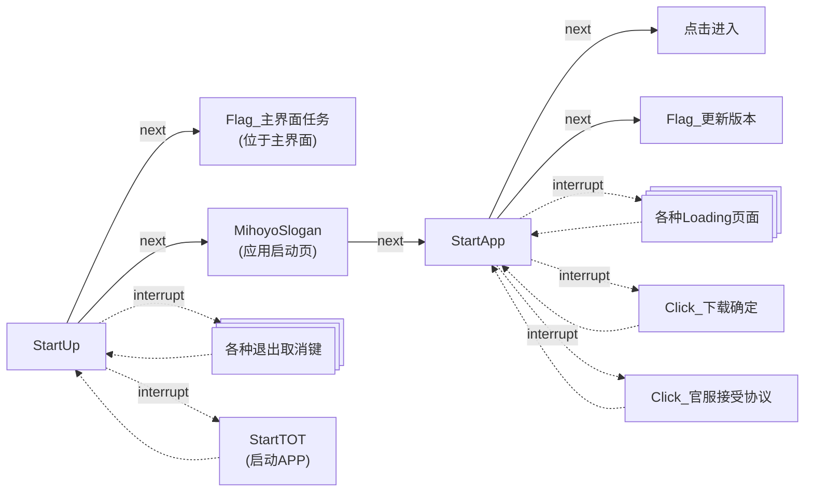
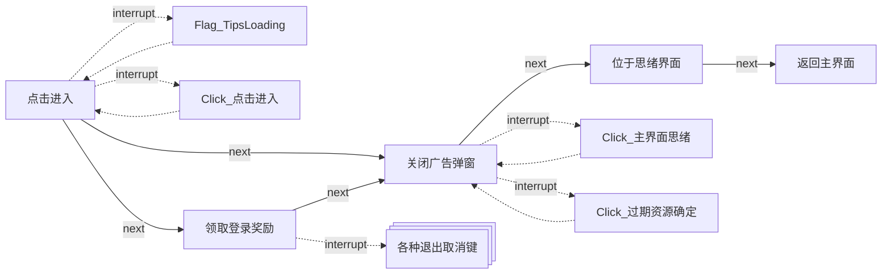
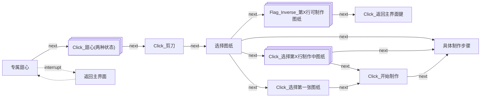
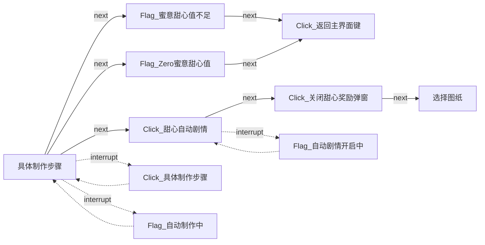
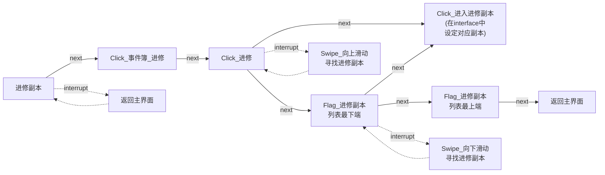
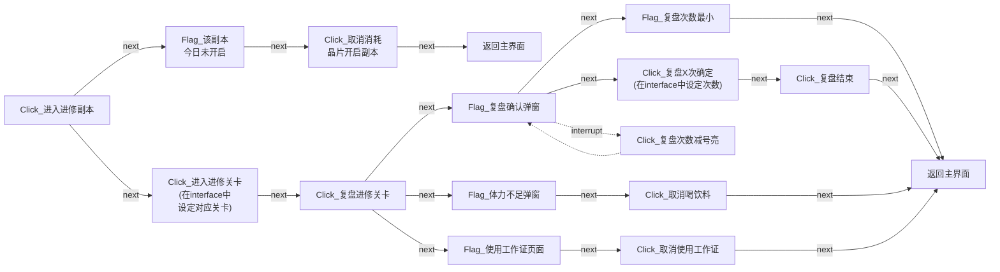
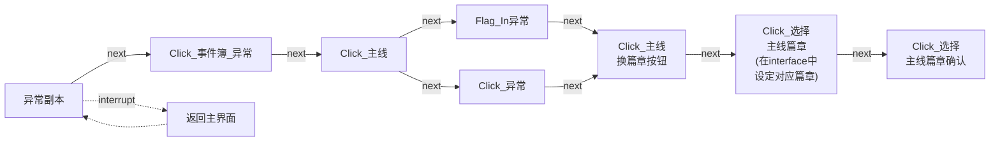
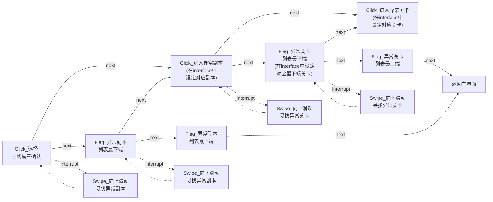
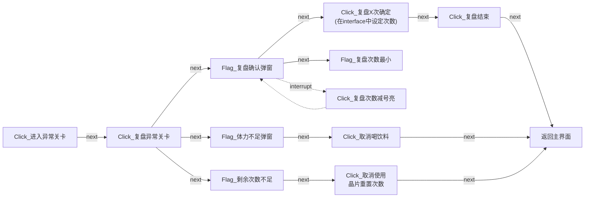

## 基础说明

`assets/resource/base` 存放官服资源。

`assets/resource/bilibili` 存放B服资源。

程序运行时会读取相应目录中所有的 json 格式文件，将任务划分到不同 json 文件中只是为了开发时容易阅读和理解。

**要注意的是，无论选择哪个客户端，程序都会先读取 `assets/resource/base` 中的文件，再读取相应目录中的文件。**

**如果有重复任务，`assets/resource/base` 中的内容会被覆盖。但只有任务中相同字段的内容会被覆盖，其余字段的内容会保留。**

由于不同客户端往往只有启动和关闭时的任务有区别，所以大部分功能代码我们存放在 `assets/resource/base` 中。

以下是各个文件的大致说明：

 - [startup.json](#startup) 启动游戏客户端。
 - [shutdown.json](#shutdown) 关闭游戏客户端。
 - [领取邮件.json](#领取邮件) 领取邮件奖励。
 - [领取友谊徽章.json](#领取友谊徽章) 领取友谊徽章。
 - [专属甜心.json](#专属甜心) 包含专属甜心自动制作服饰。制作家装的功能还没写。
 - [逸梦.json](#逸梦) 只有领取花露的功能，遇到花露收集满的情况会退出。
 - [进修副本.json](#进修副本) 复盘进修副本。
 - [异常副本.json](#异常副本) 复盘异常副本。为了方便使用，在`interface.json`中设置角色材料、印象材料和思绪残影三种任务入口。
 - [utils.json](#utils) 包含一些常用的功能, 如返回主界面、关闭奖励弹窗、点击自动剧情键等。
 - [my_task.json](#my_task) 是一个任务流水线 demo ，在实际开发中不使用，仅是方便开发者理解 Pipeline 的执行次序。

文档[使用颜色](Colors.html)是可视化界面的日志文字颜色。

## <span id="startup">startup.json</span>

### `StartUp`

启动 App 的入口任务。





### `关闭广告弹窗`

功能是关闭广告弹窗。

广告弹窗形状多变没有一致的的关闭按钮，但都不会遮盖主界面底端的功能按钮，所以点击底端**思绪**按钮关闭弹窗。

因为每次点击后会短暂出现正常主界面，识别主界面的元素难以判定广告是否全部关闭，所以一直点击**思绪**按钮，直到打开思绪界面，程序识别到思绪界面顶端的**思绪整理**才停止点击。

## <span id="shutdown">shutdown.json</span>

### `CloseTOT`

功能是关闭 App ，通常不做更改。

## <span id="领取邮件">领取邮件.json</span>

### `领取邮件`

领取邮件的入口任务。

## <span id="专属甜心">专属甜心.json</span>



### `Click_选择第一行制作中图纸`

`next`列表里必须有`具体制作步骤`，因为夏彦完成步骤的按钮颜色，与图纸黄色进度条颜色相同，识别到`Click_选择第一行制作中图纸`时也可能在夏彦的图纸具体制作步骤页面。




### `Flag_自动制作中`

`expected`列表包含的候选项不用删，因为每个男主的界面里这个自动按钮的位置不一样（马哈鱼快出来挨打），而且字体颜色与背景颜色相近，有时就是会识别出奇怪的文字。

## <span id="逸梦">逸梦.json</span>

```mermaid
flowchart LR

```

### `Swipe_收取花露第X行` 

(之前我不知道可以滑动收集，是先识别四位男主的逸梦，再分别匹配四位男主的花上四角星，不仅收集不全还可能因为背景长得像花上四角星而卡住，现在用七个横向滑动来收集花露，简单又好用。以后还要是要好好听小初代说话啦ヾ(×∧×)ノ)

## <span id="utils">utils.json</span>

```mermaid
flowchart LR

```

## <span id="进修副本">进修副本.json</span>





## <span id="异常副本">异常副本.json</span>







## <span id="使用颜色">使用颜色</span>

**普通提示** <font color=#696969>昏灰 Dimgray #696969</font>

**任务失败** <font color=#FF0000>红色 Red #FF0000</font>

**任务完成** <font color=#32cd32>柠檬绿 Limegreen #32cd32</font>

**消极类提示** <font color=#FFA500>橙色 Orange #FFA500</font>

**积极类提示** <font color=#00BFFF>深天蓝 Deepskyblue #00BFFF</font>
