## 基础说明

`assets/resource/base` 存放官服资源。

`assets/resource/bilibili` 存放B服资源。

程序运行时会读取相应目录中所有的 json 格式文件，将任务划分到不同 json 文件中只是为了开发时容易阅读和理解。

**要注意的是，无论选择哪个客户端，程序都会先读取 `assets/resource/base` 中的文件，再读取相应目录中的文件。**

**如果有重复任务，`assets/resource/base` 中的内容会被覆盖。但只有任务中相同字段的内容会被覆盖，其余字段的内容会保留。**

由于不同客户端往往只有启动和关闭时的任务有区别，所以大部分功能代码我们存放在 `assets/resource/base` 中。

以下是各个文件的大致说明：

 - [startup.json](#startup) 启动游戏客户端。
 - [shutdown.json](#shutdown) 关闭游戏客户端。
 - [utils.json](#utils) 包含一些常用的功能, 如返回主界面、复盘确认、点击自动出卡等。
 - [领取邮件.json](#领取邮件) 领取邮件奖励。
 - [领取友谊徽章.json](#领取友谊徽章) 领取友谊徽章。
 - [领取基地奖励.json](#领取基地奖励) 领取资源申请、领取案件解析、领取酬谢。
 - [好感度.json](#好感度) 触摸获取好感度。
 - [逸梦.json](#逸梦) 只有收取花露和捕梦的功能，遇到花露收集满的情况会退出。需要手动选择新的梦笺。
 - [专属甜心.json](#专属甜心) 包含专属甜心自动制作服饰。制作家装的功能还没写。
 - [进修副本.json](#进修副本) 复盘进修副本。
 - [异常副本.json](#异常副本) 复盘异常副本。为了方便使用，在`interface.json`中设置角色材料、印象材料和思绪残影三种任务入口。
 - [外勤委托.json](#外勤委托) 外勤委托。
 - [补充体力.json](#补充体力) 补充体力。
 - [my_task.json](#my_task) 是一个任务流水线 demo ，在实际开发中不使用，仅是方便开发者理解 Pipeline 的执行次序。

文档[使用颜色](#使用颜色)是可视化界面的日志文字颜色。

## 代码规范

1. 标注roi

    为了节省资源和防止误判，除非必要，请划定识别范围，不要全屏识别。

## <span id="startup">startup.json</span>

### `StartUp`

启动 App 的入口任务。

 - 官服启动类：`"package": "com.miHoYo.wd/com.miHoYo.wd.MainActivity"`
 - B服启动类：`"package": "com.miHoYo.wd.bilibili/com.miHoYo.wd.MainActivity"`

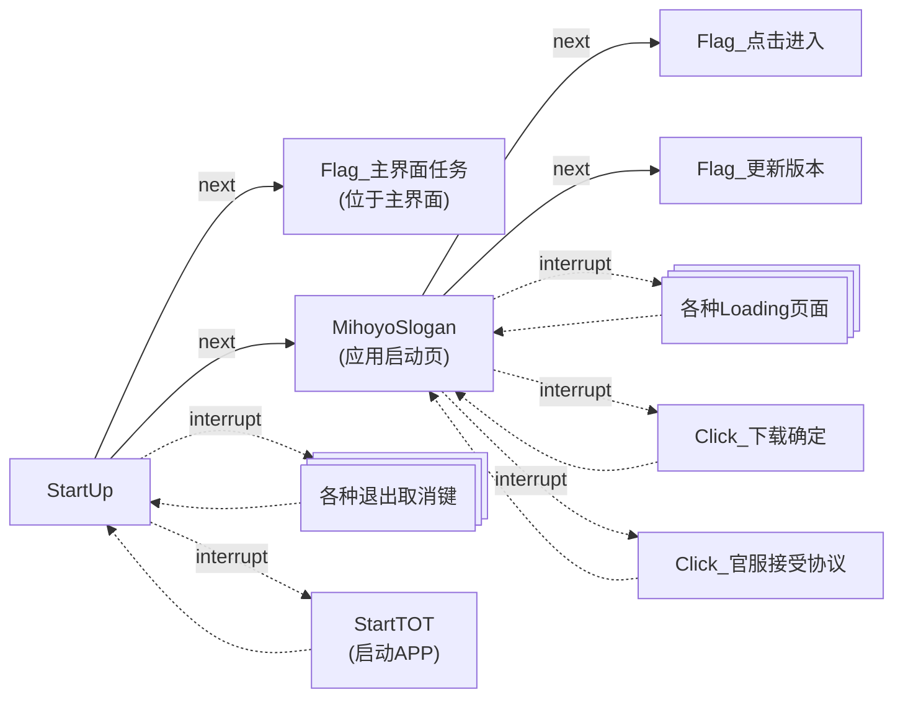

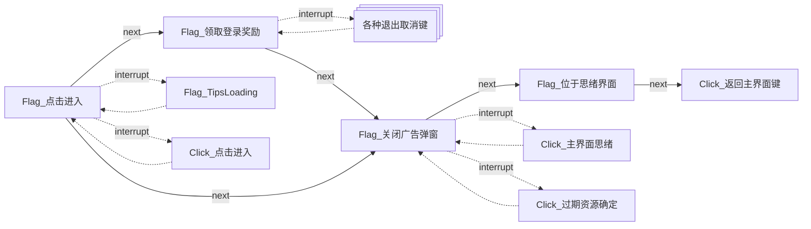

### `关闭广告弹窗`

功能是关闭广告弹窗。

广告弹窗形状多变没有一致的的关闭按钮，但都不会遮盖主界面底端的功能按钮，所以点击底端**思绪**按钮关闭弹窗。

因为每次点击后会短暂出现正常主界面，识别主界面的元素难以判定广告是否全部关闭，所以一直点击**思绪**按钮，直到打开思绪界面，程序识别到思绪界面顶端的**思绪整理**才停止点击。

## <span id="shutdown">shutdown.json</span>

### `CloseTOT`

功能是关闭 App ，通常不做更改。

## <span id="utils">utils.json</span>

包含一些常用的功能, 如返回主界面、复盘确认、点击自动出卡等。

编写新任务时可以复制 `utils.json` 中的各种节点，在复制版本中添加后续节点。通常给复制版本添加名称后缀来区别新节点和原节点。

例如：原节点 `Click_事件簿` ，复制到 `进修副本.json` 中并更名为 `Click_事件簿_进修` ，添加next节点`Click_进修`；复制到 `异常副本.json` 中并更名为 `Click_事件簿_异常` ，添加next节点`Click_主线`。

### `返回主界面`

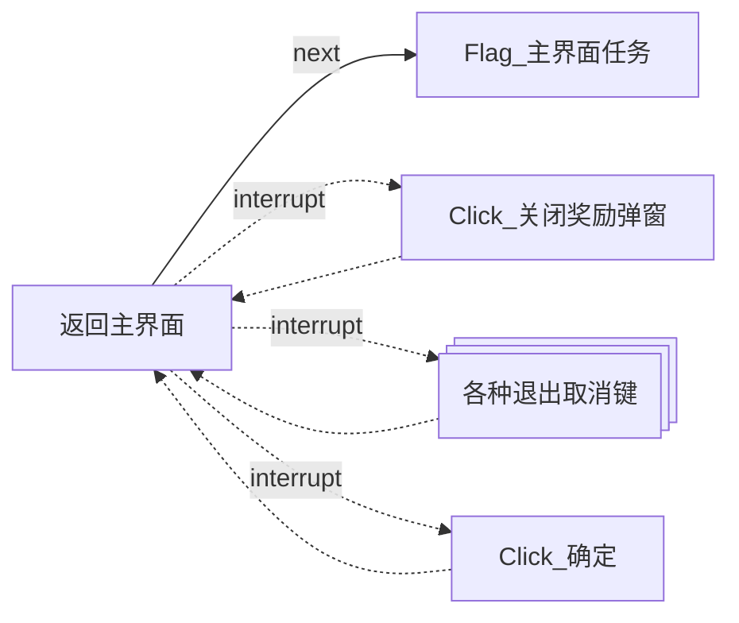

使用 `主界面任务` 作为任务终止节点。因为主界面大部分区域都可能变动，所以识别任务按钮来判断是否回到主界面，识别其他固定按钮也是可以的。

只有在过期资源回收时才会用到确定键，为了防止误点击确定键， `Click_确定`放在最后，取消键识别失败后才会识别确定键。

### `Flag_复盘确认弹窗`

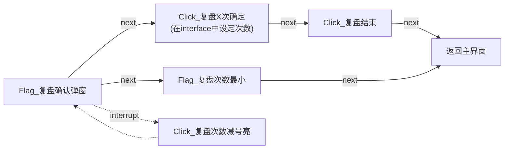

通用的复盘确认任务链，在进修副本和异常副本中都有使用。

### `Click_居中开始辩论`

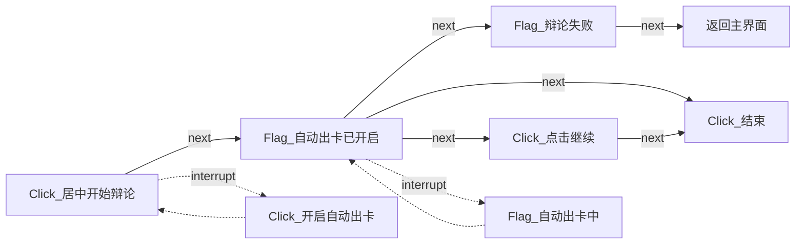

外勤委托使用的辩论任务链，辩论成功后（即点击结束键后）停留在外勤界面。在外勤委托中会回到识别节点，再次识别是否有日常委托或庭审委托。

## <span id="领取邮件">领取邮件.json</span>

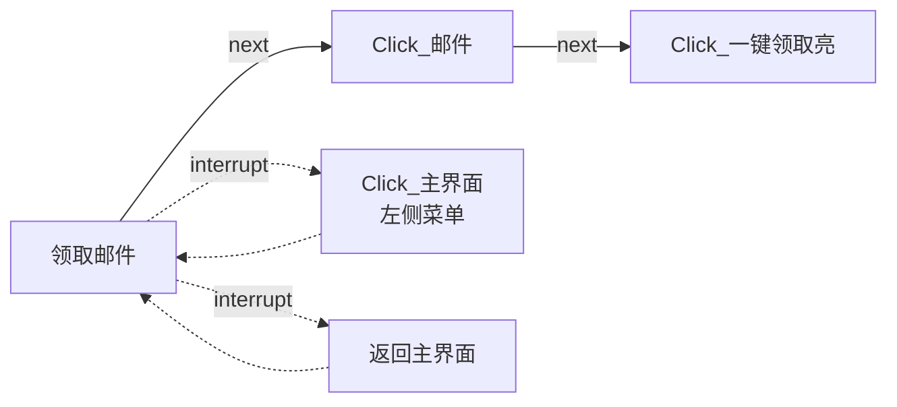

### `Click_一键领取亮`

领取邮件的结束任务。因为**一键领取**按钮亮暗变化不明显，为了避免陷入死循环，点击一次后就视为完成任务。关闭弹窗和返回主界面等操作交给后续任务。我们在每个任务开头都添加了返回主界面的中断操作。

## <span id="领取友谊徽章">领取友谊徽章.json</span>

任务链逻辑与领取邮件相同，仅修改入口按钮。

## <span id="领取基地奖励">领取基地奖励.json</span>

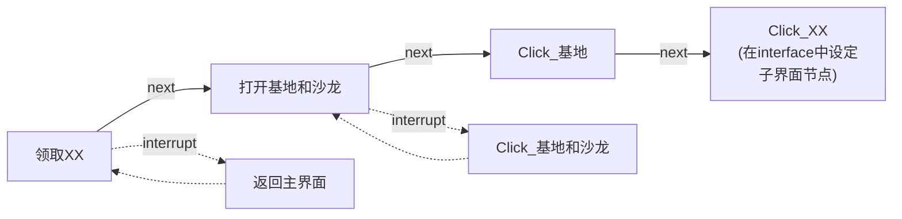

基地中包括**资源申请**、**资料室**和**酬谢**三个子界面。三套任务链逻辑相同，仅入口任务和子界面节点不同。

### `资源申请`

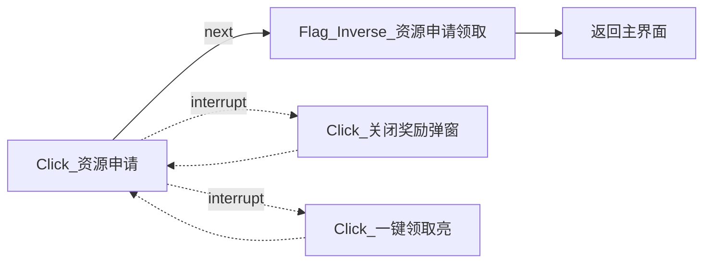

`Flag_Inverse_资源申请领取`节点中开启了 inverse 字段（反转识别结果），在识别到**领取**按钮时不进入此节点，在没有识别到**领取**按钮时才进入节点。

### `案件解析`

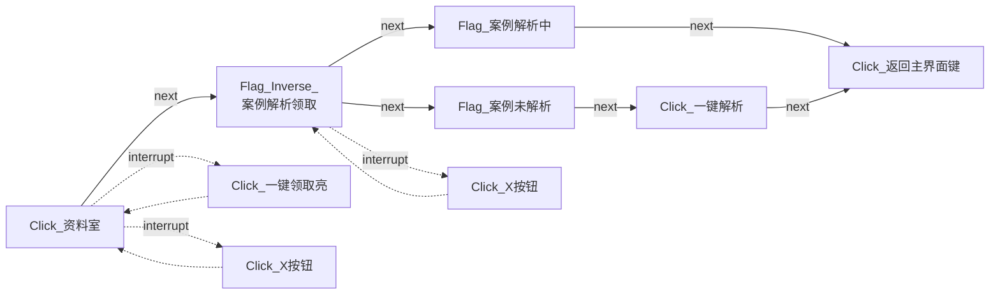

`Flag_Inverse_资料解析领取`节点中开启了 `inverse` 字段（反转识别结果），在识别到**领取**按钮时不进入此节点，在没有识别到**领取**按钮时才进入节点。`inverse` 字段使用很少，受游戏过程动画的影响，程序可能截到各种预料不到的中间画面，导致任务进入含有 `inverse` 字段的节点。例如：点击进入资料室后可能截取到无UI的资料室背景图片，此任务中给 `Click_资料室` 节点添加了很长的延时来解决这个问题。

### `领取酬谢`

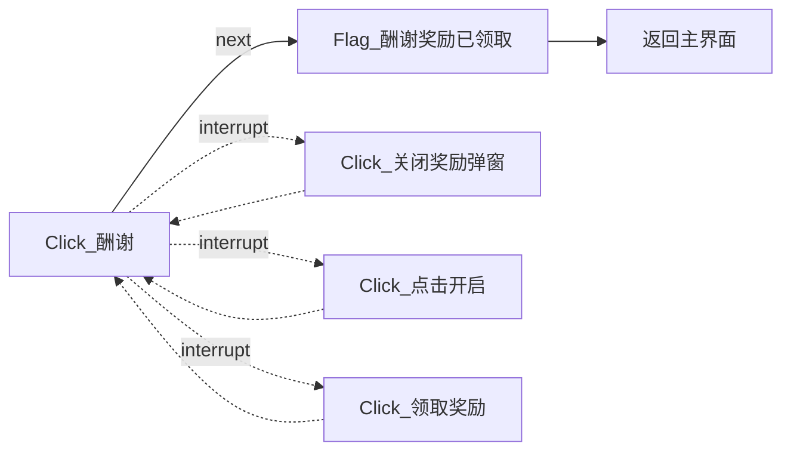

酬谢包括每日和每周，每周酬谢会直接弹出奖励弹窗，每日酬谢需要点击**领取奖励**按钮领取。

## <span id="好感度">好感度.json</span>

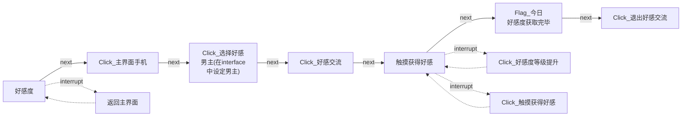

## <span id="逸梦">逸梦.json</span>

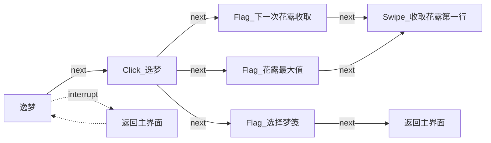

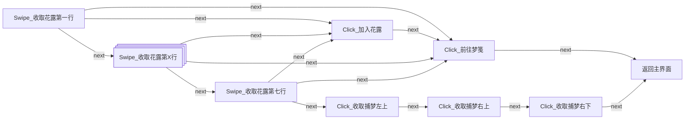

### `Swipe_收取花露第X行` 

每次滑动后判断是否可以加入花露。因为点击加入花露后可能出现梦笺收集完毕，需要选择新的梦笺的情况，所以暂时在加入花露后直接退出逸梦系统避免任务出错。

(之前我不知道可以滑动收集，是先识别四位男主的逸梦，再分别匹配四位男主的花上四角星，不仅收集不全还可能因为背景长得像花上四角星而卡住，现在用七个横向滑动来收集花露，简单又好用。以后还要是要好好听小初代说话啦ヾ(×∧×)ノ)

在滑动过程中游戏可能自动加入花露，无法收集捕梦。捕梦任务链待优化中（开摆！）

## <span id="专属甜心">专属甜心.json</span>

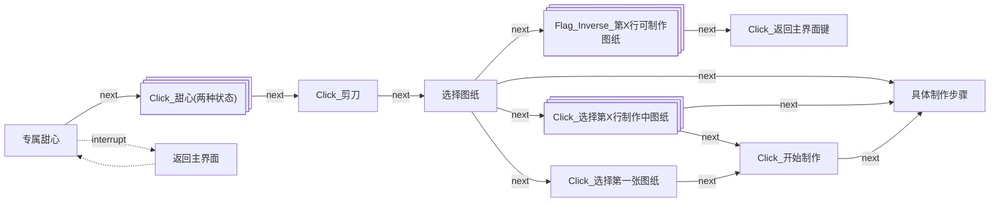

### `Click_选择第一行制作中图纸`

`next`列表里必须有`具体制作步骤`，因为夏彦完成步骤的按钮颜色，与图纸黄色进度条颜色相同，识别到`Click_选择第一行制作中图纸`时也可能在夏彦的图纸具体制作步骤页面。

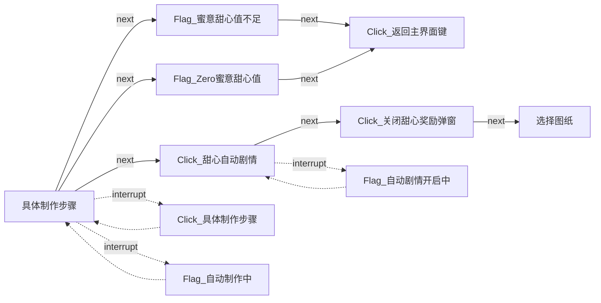

### `Flag_自动制作中`

`expected`列表包含的候选项不用删，因为每个男主的界面里这个自动按钮的位置不一样（马哈鱼快出来挨打），而且字体颜色与背景颜色相近，有时就是会识别出奇怪的文字。

## <span id="进修副本">进修副本.json</span>

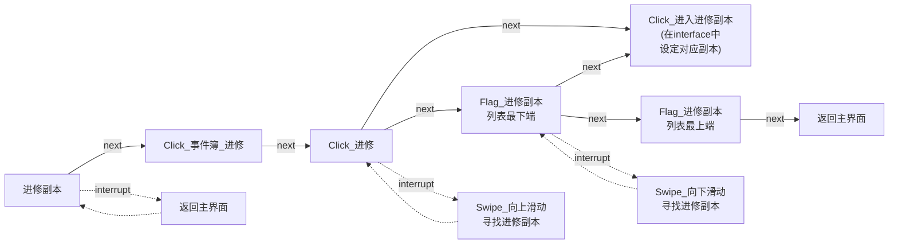

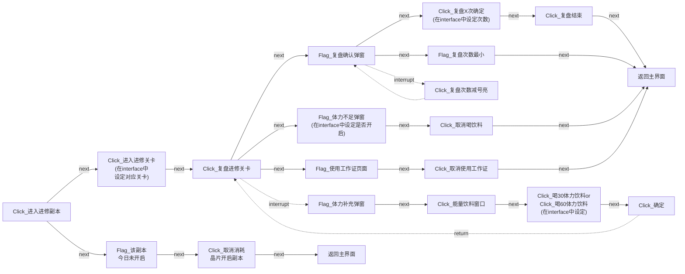

## <span id="异常副本">异常副本.json</span>

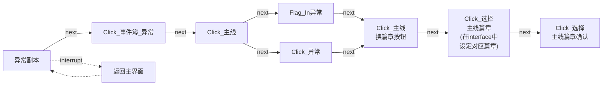

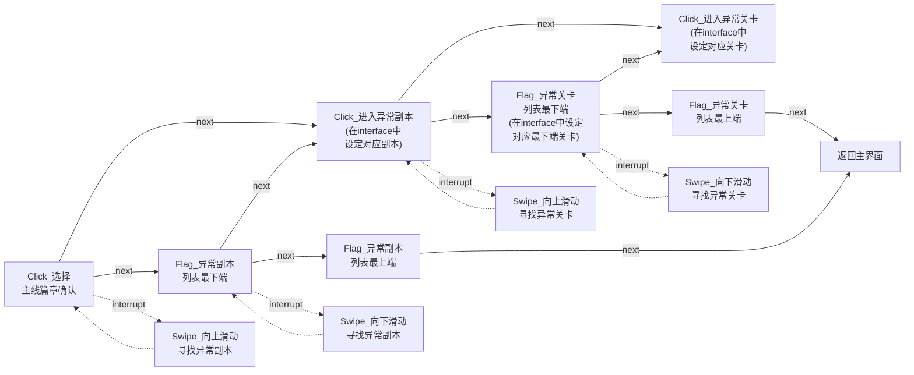

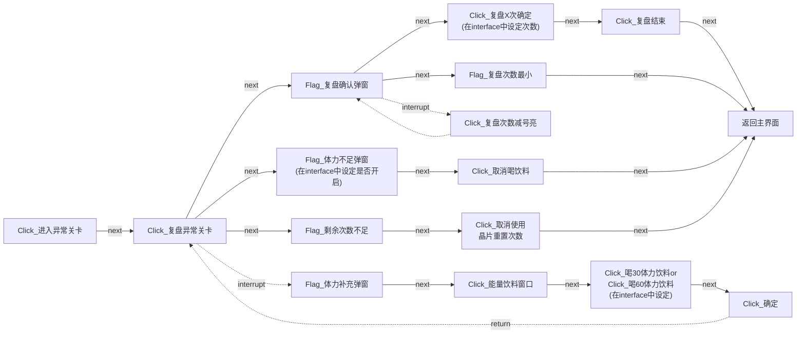

## <span id="外勤委托">外勤委托.json</span>

```mermaid
flowchart LR
    n0["外勤委托"] -->|next| n1["Click_未名日程"]
    n0 -.->|interrupt| n2["返回主界面"]
    n2 -.-> n0
    n1 -->|next| n3["Click_外勤"]
    n3 -->|next| n4["Click_法律援助"]
    n4 -->|next| n5["Click_进入外勤区域<br>(在interface中设定区域)"]
```

```mermaid
flowchart LR
    n5["Click_进入外勤区域"] --->|next| n6["Flag_委托搜寻中"]
    n5 --->|next| n7["Flag_疲劳值满"]
    n5 --->|next| n10["Flag_主界面任务"]
    n5 -..->|interrupt| n11["Click_日常委托"]
    n5 -..->|interrupt| n12["Click_庭审委托"]
    n13 -.->|return| n5
    n6 -------->|next| n13["返回主界面"]
    n7 -------->|next| n13
    n11 -->|next| n16["Click_开始处理外勤委托"]
    n12 -->|next| n16

    n16 -->|next| n8["Flag_体力不足弹窗<br>(在interface中设定是否开启)"]
    n8 -->|next| n14["Click_取消喝饮料"]
    n14 ---->|next| n13["返回主界面"]

    n16 -->|next| n9["Flag_战力不足"]
    n9 ----->|next| n13["返回主界面"]
    n16 -->|next| n17["Flag_疲劳值上限弹窗"]
    n16 -->|next| n18["Click_居中开始辩论"]
    n16 -.->|interrupt| z["Flag_体力补充弹窗"]

    n17 -->|next| n19["Click_取消使用晶片提升疲劳值上限"]
    n19 ---->|next| n13["返回主界面"]
    n19 -->|interrupt| n21["Click_X按钮"]
    n21 -.-> n19

    n18["Click_居中开始辩论"] -->|next| n22["Flag_自动出卡已开启"]
    n18 -.->|interrupt| n23["Click_开启自动出卡"]
    n23 -.-> n18
    n22 -->|next| n24["Flag_辩论失败"]
    n22 -->|next| n25["Click_点击继续"]
    n22 -->|next| n26["Click_结束"]
    n25 --->|next| n26
    n22-.->|interrupt| n27["Flag_自动出卡中"]
    n27 -.-> n22
    n24 ---->|next| n13["返回主界面"]

    z -->|next| z1["Click_能量饮料窗口"]
    z1 -->|next| z2["Click_喝30体力饮料or<br>Click_喝60体力饮料<br>(在interface中设定)"]
    z2 -->|next| z3["Click_确定"]

    n26 -.->|return| n5
    z3 -.->|return| n16
```

由于 `Click_日常委托` 和 `Click_庭审委托` 在`interrupt`列表中，所以遇到战力不足或者体力不足时，虽然游戏回到了主界面但任务逻辑会回到 `Click_进入外勤区域` 节点再次进行识别。因此我们在 `Click_进入外勤区域` 的next中添加了 `Flag_主界面任务` 作为任务出口。 `Click_居中开始辩论` 节点和后续节点位于 `utils.json` 中，如果辩论成功则会停留在外勤界面，如果辩论失败则会回到主界面。

## <span id="补充体力">补充体力.json</span>

```mermaid
flowchart LR
    n0["补充体力"] -->|next| n1["Click_主界面体力"]
    n0 -.->|interrupt| n2["返回主界面"]
    n2 -.-> n0
    n1 -->|next| n3["Flag_体力补充弹窗"]
    n3 -->|next| n4["Click_能量饮料窗口"]
    n4 -->|next| n5["Click_喝30体力饮料or<br>Click_喝60体力饮料<br>(在interface中设定)"]
    n5 -->|next| n6["Click_确定"]
```

补充体力暂时无法设置使用数量。

## <span id="使用颜色">使用颜色</span>

**普通提示** <font color=#696969>昏灰 Dimgray #696969</font>

**任务失败** <font color=#FF0000>红色 Red #FF0000</font>

**任务完成** <font color=#32cd32>柠檬绿 Limegreen #32cd32</font>

**消极类提示** <font color=#FFA500>橙色 Orange #FFA500</font>

**积极类提示** <font color=#00BFFF>深天蓝 Deepskyblue #00BFFF</font>
