## 基础说明

`assets/resource/base` 存放官服资源。

`assets/resource/bilibili` 存放B服资源。

程序运行时会读取相应目录中所有的 json 格式文件，将任务划分到不同 json 文件中只是为了开发时容易阅读和理解。

**要注意的是，无论选择哪个客户端，程序都会先读取 `assets/resource/base` 中的文件，再读取相应目录中的文件。**

**如果有重复任务，`assets/resource/base` 中的内容会被覆盖。但只有任务中相同字段的内容会被覆盖，其余字段的内容会保留。**

由于不同客户端往往只有启动和关闭时的任务有区别，所以大部分功能代码我们存放在 `assets/resource/base` 中。

以下是各个文件的大致说明：

 - [startup.json](#startup) 启动游戏客户端。
 - [shutdown.json](#shutdown) 关闭游戏客户端。
 - [utils.json](#utils) 包含一些常用的功能，如返回主界面、复盘确认、点击自动出卡等。
 - [领取邮件.json](#领取邮件) 领取邮件奖励。
 - [领取友谊徽章.json](#领取友谊徽章) 领取友谊徽章。
 - [领取基地奖励.json](#领取基地奖励) 领取资源申请、领取案件解析、领取酬谢。
 - [领取任务奖励.json](#领取任务奖励) 领取每日/每周任务活跃度奖励。
 - [领取绮思奖励.json](#领取绮思奖励) 领取绮思（战令）经验和等级奖励。
 - [好感度.json](#好感度) 触摸获取好感度。
 - [逸梦.json](#逸梦) 只有收取花露和捕梦的功能，遇到花露收集满的情况会退出。需要手动选择新的梦笺。
 - [你我之间.json](#你我之间) "你我之间"每日互动：记录心情、准备物品、回应动态、习惯打卡。
 - [专属甜心.json](#专属甜心) 包含专属甜心自动制作服饰。制作家装的功能还没写。
 - [进修副本.json](#进修副本) 复盘进修副本。
 - [异常副本.json](#异常副本) 复盘异常副本。为了方便使用，在`interface.json`中设置角色材料、印象材料和思绪残影三种任务入口。
 - [外勤委托.json](#外勤委托) 外勤委托。
 - [试炼神殿.json](#试炼神殿) 试炼神殿周常副本（每周一次）。
 - [补充体力.json](#补充体力) 手动补充体力（独立入口，用于提前补满体力）。
 - [体力检查.json](#体力检查) 体力检查入口（在任务开始前自动检查并补充体力）。
 - [未名市移动.json](#未名市移动) 未名市地图导航移动（计划中）。
 - [未名市周任务.json](#未名市周任务) 未名市周任务（计划中，154 nodes）。
 - [思绪张数任务.json](#思绪张数任务) 往期活动关卡中的思绪张数任务（计划中，暂未启用）。
 - [拼图活动.json](#拼图活动) 限时拼图活动代币领取。
 - [翻格活动.json](#翻格活动) 限时翻格活动代币领取。
 - [购买免费礼包.json](#购买免费礼包) 商城限时免费礼包购买。
 - [提交材料活动.json](#提交材料活动) 限时提交材料活动。

文档[使用颜色](#使用颜色)是可视化界面的日志文字颜色。

## startup.json

### `StartUp`

启动 App 的入口任务。

 - 官服启动类：`"package": "com.miHoYo.wd/com.miHoYo.wd.MainActivity"`
 - B服启动类：`"package": "com.miHoYo.wd.bilibili/com.miHoYo.wd.MainActivity"`

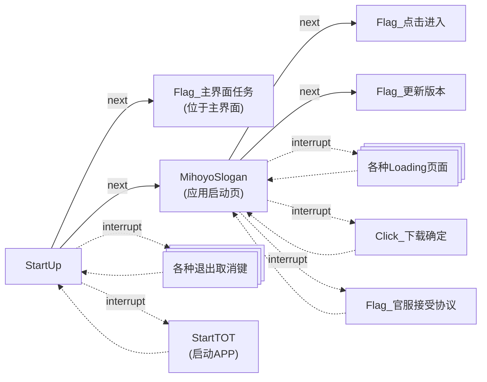
```mermaid
flowchart LR
    n0["StartUp"] -->|next| n1["Flag_主界面任务<br>(位于主界面)"]
    n0 -->|next| n2["MihoyoSlogan<br>(应用启动页)"]
    n0 -.->|interrupt| n3@{ shape: processes, label: "各种退出取消键"}
    n3 -.-> n0
    n0 -.->|interrupt| n4["StartTOT<br>(启动APP)"]
    n4 -.-> n0

    n2 -->|next| n6["Flag_点击进入"]
    n2 -->|next| n7["Flag_更新版本"]
    n2 -.->|interrupt| n8@{ shape: processes, label: "各种Loading页面"}
    n8 -.-> n2
    n2 -.->|interrupt| n9["Click_下载确定"]
    n9 -.-> n2
    n2 -.->|interrupt| n10["Flag_官服接受协议"]
    n10 -.-> n2
```

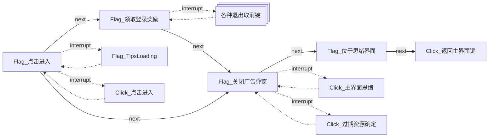
```mermaid
flowchart LR
    n6["Flag_点击进入"] -->|next| n10["Flag_领取登录奖励"]
    n10 -.->|interrupt| n14@{ shape: processes, label: "各种退出取消键"}
    n14 -.-> n10
    n10["Flag_领取登录奖励"] -->|next| n11
    n6 -->|next| n11["Flag_关闭广告弹窗"]
    n11["Flag_关闭广告弹窗"] -->|next| n15["Flag_位于思绪界面"]
    n11 -.->|interrupt| n16["Click_主界面思绪"]
    n16 -.-> n11
    n11 -.->|interrupt| n17["Click_过期资源确定"]
    n17 -.-> n11
    n15 -->|next| n18["Click_返回主界面键"]
    n6 -.->|interrupt| n12["Flag_TipsLoading"]
    n12 -.-> n6
    n6 -.->|interrupt| n13["Click_点击进入"]
    n13 -.-> n6

```

### `关闭广告弹窗`

功能是关闭广告弹窗。

广告弹窗形状多变没有一致的的关闭按钮，但都不会遮盖主界面底端的功能按钮，所以点击底端**思绪**按钮关闭弹窗。

因为每次点击后会短暂出现正常主界面，识别主界面的元素难以判定广告是否全部关闭，所以一直点击**思绪**按钮，直到打开思绪界面，程序识别到思绪界面顶端的**思绪整理**才停止点击。

## shutdown.json

### `CloseTOT`

功能是关闭 App ，通常不做更改。

## utils.json

包含一些常用的功能，如返回主界面、复盘确认、点击自动出卡等。

编写新任务时可以复制 `utils.json` 中的各种节点，在复制版本中添加后续节点。通常给复制版本添加名称后缀来区别新节点和原节点。

例如：原节点 `Click_事件簿` ，复制到 `进修副本.json` 中并更名为 `Click_事件簿_进修` ，添加next节点`Click_进修`；复制到 `异常副本.json` 中并更名为 `Click_事件簿_异常` ，添加next节点`Click_主线`。

### `返回主界面`

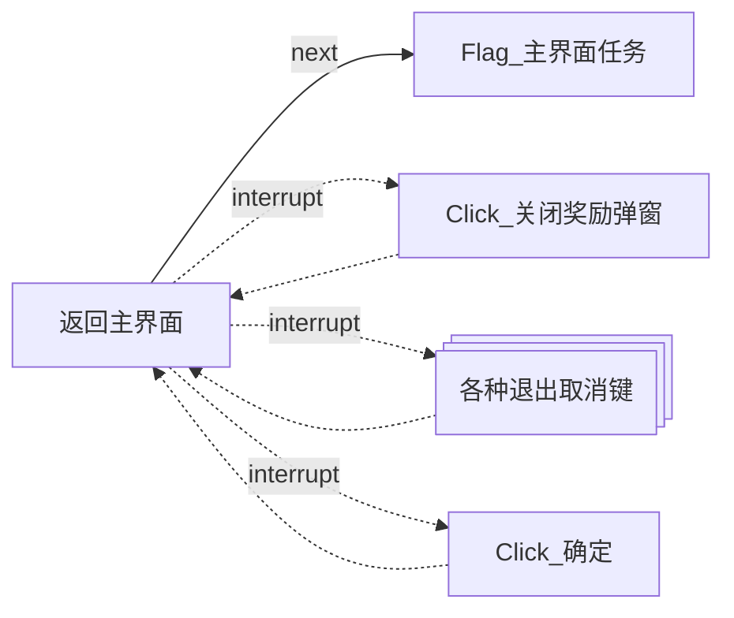
```mermaid
flowchart LR
    n0["返回主界面"] -->|next| n1["Flag_主界面任务"]
    n0 -.->|interrupt| n2["Click_关闭奖励弹窗"]
    n2 -.-> n0
    n0 -.->|interrupt| n3@{ shape: processes, label: "各种退出取消键"}
    n3 -.-> n0
    n0 -.->|interrupt| n4["Click_确定"]
    n4 -.-> n0
```

使用 `主界面任务` 作为任务终止节点。因为主界面大部分区域都可能变动，所以识别任务按钮来判断是否回到主界面，识别其他固定按钮也是可以的。

只有在过期资源回收时才会用到确定键，为了防止误点击确定键， `Click_确定`放在最后，取消键识别失败后才会识别确定键。

### `Flag_复盘确认弹窗`

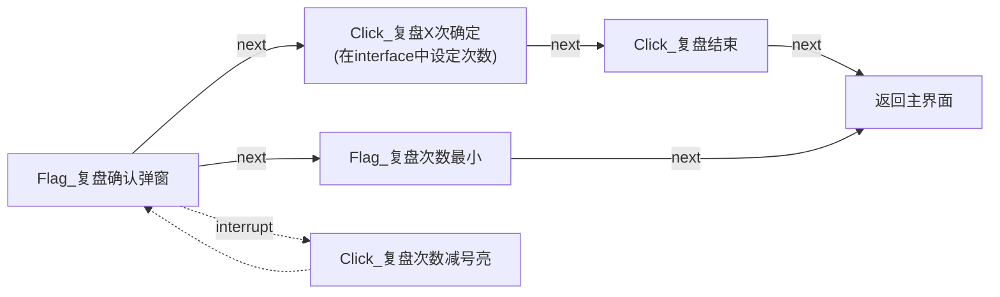
```mermaid
flowchart LR
    n18["Flag_复盘确认弹窗"] -->|next| n21["Click_复盘X次确定<br>(在interface中设定次数)"]
    n18["Flag_复盘确认弹窗"] -->|next| n22["Flag_复盘次数最小"]
    n18 -.->|interrupt| n23["Click_复盘次数减号亮"]
    n23 -.-> n18
    n21["Click_复盘X次确定<br>(在interface中设定次数)"] -->|next| n24["Click_复盘结束"]
    n24 -->|next| n012["返回主界面"]
    n22 --->|next| n012["返回主界面"]
```

通用的复盘确认任务链，在进修副本和异常副本中都有使用。

### `Click_居中开始辩论`

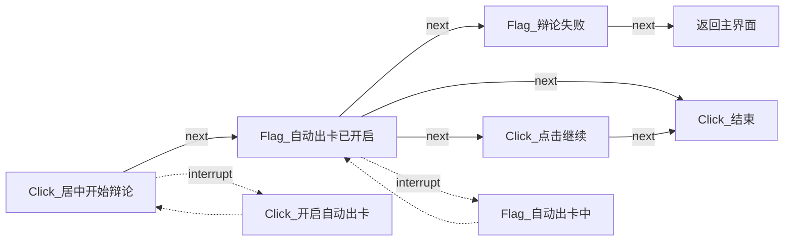
```mermaid
flowchart LR
    n18["Click_居中开始辩论"] -->|next| n20["Flag_自动出卡已开启"]
    n18 -.->|interrupt| n21["Click_开启自动出卡"]
    n21 -.-> n18
    n20 -->|next| n22["Flag_辩论失败"]
    n20 -->|next| n23["Click_点击继续"]
    n20 -->|next| n24["Click_结束"]
    n23 -->|next| n24
    n20-.->|interrupt| n25["Flag_自动出卡中"]
    n25 -.-> n20
    n22 -->|next| n26["返回主界面"]

    n25 ~~~ n24
```

外勤委托使用的辩论任务链，辩论成功后（即点击结束键后）停留在外勤界面。在外勤委托中会回到识别节点，再次识别是否有日常委托或庭审委托。

## 领取邮件.json

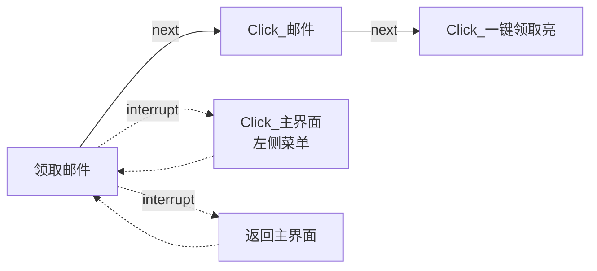
```mermaid
flowchart LR
    n0["领取邮件"] -->|next| n1["Click_邮件"]
    n0["领取邮件"] -.->|interrupt| n2["Click_主界面<br>左侧菜单"]
    n2 -.-> n0
    n0["领取邮件"] -.->|interrupt| n3["返回主界面"]
    n3 -.-> n0
    n1["Click_邮件"] -->|next| n4["Click_一键领取亮"]
```

### `Click_一键领取亮`

领取邮件的结束任务。因为**一键领取**按钮亮暗变化不明显，为了避免陷入死循环，点击一次后就视为完成任务。关闭弹窗和返回主界面等操作交给后续任务。我们在每个任务开头都添加了返回主界面的中断操作。

## 领取友谊徽章.json

任务链逻辑与领取邮件相同，仅修改入口按钮。

## 领取基地奖励.json

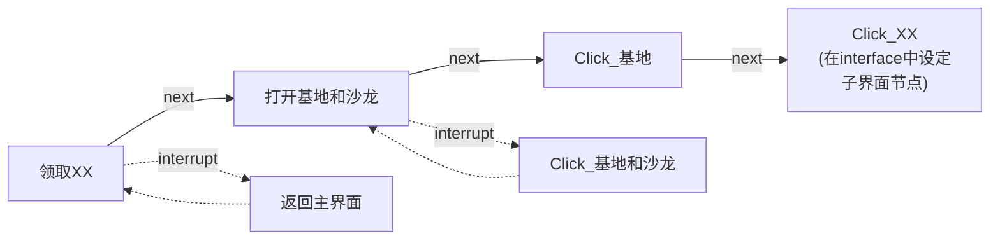
```mermaid
flowchart LR
    n0["领取XX"] -->|next| n1["打开基地和沙龙"]
    n0 -.->|interrupt| n00["返回主界面"]
    n00 -.-> n0

    n1["打开基地和沙龙"] -->|next| n2["Click_基地"]
    n1 -.->|interrupt| n3["Click_基地和沙龙"]
    n3 -.-> n1
    n2 -->|next| n4["Click_XX<br>(在interface中设定<br>子界面节点)"]
```

基地中包括**资源申请**、**资料室**和**酬谢**三个子界面。三套任务链逻辑相同，仅入口任务和子界面节点不同。

### `资源申请`

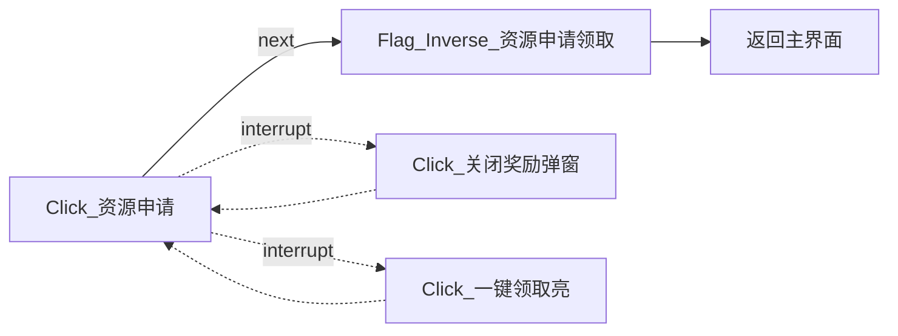
```mermaid
flowchart LR
    n5["Click_资源申请"] -->|next| n6["Flag_Inverse_资源申请领取"]
    n5 -.->|interrupt| n7["Click_关闭奖励弹窗"]
    n7 -.-> n5
    n5 -.->|interrupt| n8["Click_一键领取亮"]
    n8 -.-> n5
    n6 --> n00["返回主界面"]
```

`Flag_Inverse_资源申请领取`节点中开启了 inverse 字段（反转识别结果），在识别到**领取**按钮时不进入此节点，在没有识别到**领取**按钮时才进入节点。

### `案件解析`

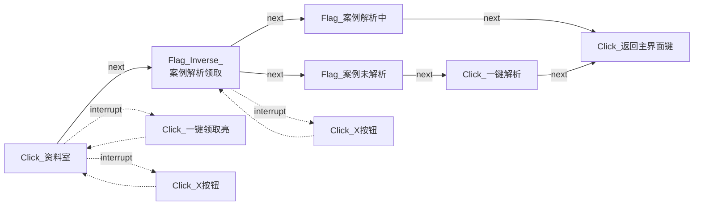
```mermaid
flowchart LR
    n9["Click_资料室"] -->|next| n10["Flag_Inverse_<br>案例解析领取"]
    n9 -.->|interrupt| n11["Click_一键领取亮"]
    n11 -.-> n9
    n9 -.->|interrupt| n12["Click_X按钮"]
    n12 -.-> n9

    n10 -->|next| n14["Flag_案例未解析"]
    n10 -->|next| n15["Flag_案例解析中"]
    n10 -.->|interrupt| n16["Click_X按钮"]
    n16 -.-> n10
    n14 -->|next| n17["Click_一键解析"]
    n15 --->|next| n18["Click_返回主界面键"]
    n17 -->|next| n18
```

`Flag_Inverse_资料解析领取`节点中开启了 `inverse` 字段（反转识别结果），在识别到**领取**按钮时不进入此节点，在没有识别到**领取**按钮时才进入节点。`inverse` 字段使用很少，受游戏过程动画的影响，程序可能截到各种预料不到的中间画面，导致任务进入含有 `inverse` 字段的节点。例如：点击进入资料室后可能截取到无UI的资料室背景图片，此任务中给 `Click_资料室` 节点添加了很长的延时来解决这个问题。

### `领取酬谢`

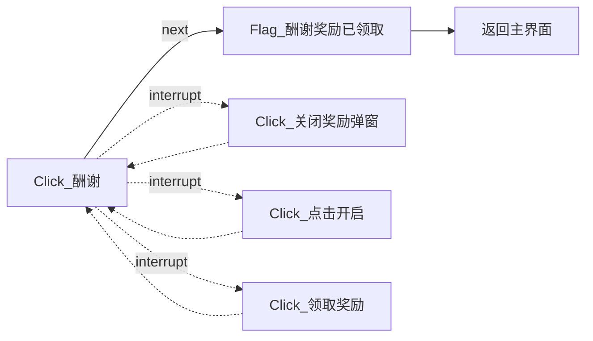
```mermaid
flowchart LR
    n19["Click_酬谢"] -->|next| n20["Flag_酬谢奖励已领取"]
    n19 -.->|interrupt| n21["Click_关闭奖励弹窗"]
    n21 -.-> n19
    n19 -.->|interrupt| n22["Click_点击开启"]
    n22 -.-> n19
    n19 -.->|interrupt| n23["Click_领取奖励"]
    n23 -.-> n19
    n20 --> n00["返回主界面"]
```

酬谢包括每日和每周，每周酬谢会直接弹出奖励弹窗，每日酬谢需要点击**领取奖励**按钮领取。

## 领取任务奖励.json

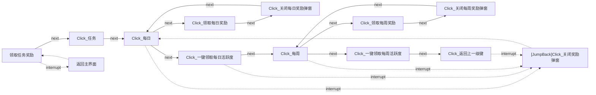
```mermaid
flowchart LR
    n0["领取任务奖励"] -->|next| n1["Click_任务"]
    n0 -.->|interrupt| n2["返回主界面"]
    n2 -.-> n0
    n1 -->|next| n3["Click_每日"]
    n3 -->|next| n4["Click_领取每日奖励"]
    n3 -->|next| n5["Click_一键领取每日活跃度"]
    n3 -.->|interrupt| n6["[JumpBack]Click_关闭奖励弹窗"]
    n6 -.-> n3
    n4 -->|next| n7["Click_关闭每日奖励弹窗"]
    n7 -->|next| n3
    n5 -->|next| n8["Click_每周"]
    n5 -.->|interrupt| n6
    n8 -->|next| n9["Click_领取每周奖励"]
    n8 -->|next| n10["Click_一键领取每周活跃度"]
    n8 -.->|interrupt| n6
    n9 -->|next| n11["Click_关闭每周奖励弹窗"]
    n11 -->|next| n8
    n10 -->|next| n12["Click_返回上一级键"]
    n12 -.->|interrupt| n6
```

通过任务按钮进入每日/每周任务页面，分别领取每日奖励和每周奖励。奖励领取后点击关闭弹窗继续领取下一个，直到全部领取完毕。

## 领取绮思奖励.json

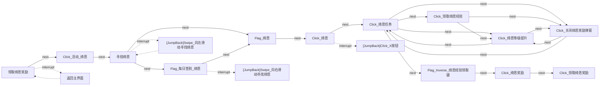
```mermaid
flowchart LR
    n0["领取绮思奖励"] -->|next| n1["Click_活动_绮思"]
    n0 -.->|interrupt| n2["返回主界面"]
    n2 -.-> n0
    n1 -->|next| n3["寻找绮思"]
    n3 -->|next| n4["Flag_绮思"]
    n3 -->|next| n5["Flag_每日签到_绮思"]
    n3 -.->|interrupt| n6["[JumpBack]Swipe_向左滑动寻找绮思"]
    n6 -.-> n3
    n5 -->|next| n4
    n5 -.->|interrupt| n7["[JumpBack]Swipe_向右滑动寻找绮思"]
    n4 -->|next| n9["Click_绮思"]
    n9 -->|next| n10["Click_绮思任务"]
    n9 -.->|interrupt| n11["[JumpBack]Click_X按钮"]
    n10 -->|next| n12["Click_领取绮思经验"]
    n10 -->|next| n13["Click_绮思等级提升"]
    n10 -->|next| n14["Click_关闭绮思奖励弹窗"]
    n10 -->|next| n15["Flag_Inverse_绮思经验领取键"]
    n12 -->|next| n13
    n12 -->|next| n14
    n14 -->|next| n13
    n14 -->|next| n10
    n13 -->|next| n14
    n13 -->|next| n10
    n15 -->|next| n16["Click_绮思奖励"]
    n16 -->|next| n17["Click_领取绮思奖励"]
```

进入活动页面后左右滑动寻找"绮思"入口。先领取绮思经验（任务经验），若已全部领取则使用 `inverse` 识别判断并跳过。经验领取完毕后切换到奖励页签领取等级奖励。

## 好感度.json

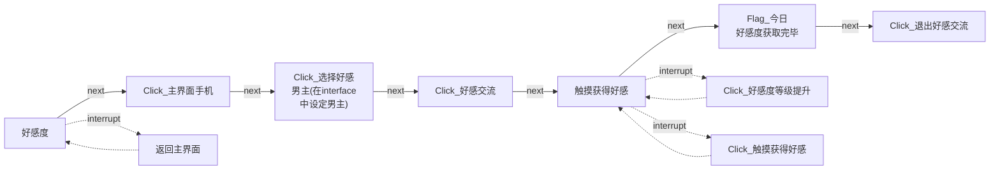
```mermaid
flowchart LR
    n0["好感度"] -->|next| n1["Click_主界面手机"]
    n0 -.->|interrupt| n2["返回主界面"]
    n2 -.-> n0
    n1 -->|next| n3["Click_选择好感<br>男主(在interface<br>中设定男主)"]
    n3 -->|next| n4["Click_好感交流"]
    n4 -->|next| n5["触摸获得好感"]
    n5 -->|next| n6["Flag_今日<br>好感度获取完毕"]
    n5 -.->|interrupt| n7["Click_好感度等级提升"]
    n7 -.-> n5
    n5 -.->|interrupt| n8["Click_触摸获得好感"]
    n8 -.-> n5
    n6 -->|next| n9["Click_退出好感交流"]
```

## 逸梦.json

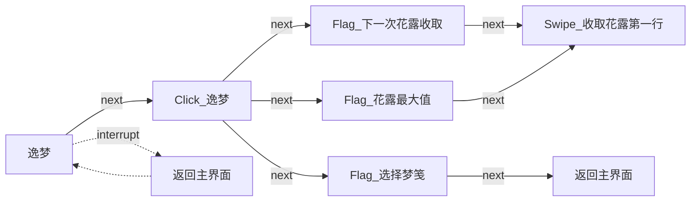
```mermaid
flowchart LR
    n0["逸梦"] -->|next| n1["Click_逸梦"]
    n0["逸梦"] -.->|interrupt| n2["返回主界面"]
    n2 -.-> n0
    n1 -->|next| n3["Flag_下一次花露收取"]
    n1 -->|next| n4["Flag_花露最大值"]
    n1 -->|next| n5["Flag_选择梦笺"]
    n3 -->|next| n6["Swipe_收取花露第一行"]
    n4 -->|next| n6
    n5 -->|next| n00["返回主界面"]
```

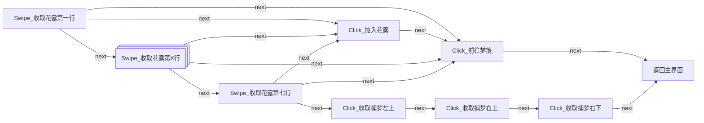
```mermaid
flowchart LR
    n6["Swipe_收取花露第一行"] -->|next| n8["Click_前往梦笺"]
    n6["Swipe_收取花露第一行"] -->|next| n7["Click_加入花露"]
    n6 -->|next| n9@{ shape: processes, label: "Swipe_收取花露第X行"}
    n7 -->|next| n8["Click_前往梦笺"]
    n8 -->|next| n00["返回主界面"]
    n9 -->|next| n7["Click_加入花露"]
    n9 -->|next| n8["Click_前往梦笺"]
    n9 -->|next| n10["Swipe_收取花露第七行"]
    n10 -->|next| n7["Click_加入花露"]
    n10 -->|next| n8["Click_前往梦笺"]
    n10 -->|next| n11["Click_收取捕梦左上"]
    n11["Click_收取捕梦左上"] -->|next| n12["Click_收取捕梦右上"]
    n12["Click_收取捕梦右上"] -->|next| n13["Click_收取捕梦右下"]
    n13["Click_收取捕梦右下"] -->|next| n00
```

### `Swipe_收取花露第X行`

每次滑动后判断是否可以加入花露。因为点击加入花露后可能出现梦笺收集完毕，需要选择新的梦笺的情况，所以暂时在加入花露后直接退出逸梦系统避免任务出错。

(之前我不知道可以滑动收集，是先识别四位男主的逸梦，再分别匹配四位男主的花上四角星，不仅收集不全还可能因为背景长得像花上四角星而卡住，现在用七个横向滑动来收集花露，简单又好用。以后还要是要好好听小初代说话啦ヾ(×∧×)ノ)

在滑动过程中游戏可能自动加入花露，无法收集捕梦。捕梦任务链待优化中（开摆！）

## 你我之间.json

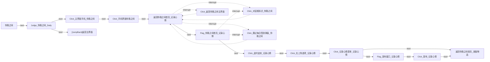
```mermaid
flowchart LR
    n0["你我之间"] -->|next| n1["Judge_你我之间_Daily"]
    n1 -->|next| n2["Click_主界面手机_你我之间"]
    n1 -->|next| n3["[JumpBack]返回主界面"]
    n2 -->|next| n4["Click_手机界面你我之间"]
    n4 -->|next| n5["返回你我之间首页_记录心情"]
    n5 -->|next| n6["Flag_你我之间首页_记录心情"]
    n5 -.->|interrupt| n7["Click_对话框标识_你我之间"]
    n5 -.->|interrupt| n8["Click_跳过每日签到弹窗_你我之间"]
    n5 -.->|interrupt| n9["Click_返回你我之间主界面"]
    n7 -.-> n5
    n8 -.-> n5
    n9 -.-> n5
    n6 -->|next| n10["Click_此时此刻_记录心情"]
    n6 -.->|interrupt| n8
    n6 -.->|interrupt| n7
    n10 -->|next| n11["Click_右上角选项_记录心情"]
    n11 -->|next| n12["Click_记录心情菜单_记录心情"]
    n12 -->|next| n13["Flag_发布窗口_记录心情"]
    n12 -->|next| n14["返回你我之间首页_准备物品"]
    n13 -->|next| n15["Click_发布_记录心情"]
    n15 -->|next| n14
```

「你我之间」包含四个子任务：**记录心情** → **准备物品** → **回应动态** → **习惯打卡**。入口处使用 `JudgeDailyTask` 进行每日周期控制，当天完成后自动跳过。每个子任务完成后返回首页，再进入下一个子任务。中间需要处理每日签到弹窗、对话气泡等干扰。

### 流程分发

每个子任务使用"返回首页"分发节点来导航：先识别首页特征（`点滴日常`），再进入对应子任务。若不在首页，通过 `interrupt` 链点击返回键、关闭弹窗等方式回到首页。

## 专属甜心.json

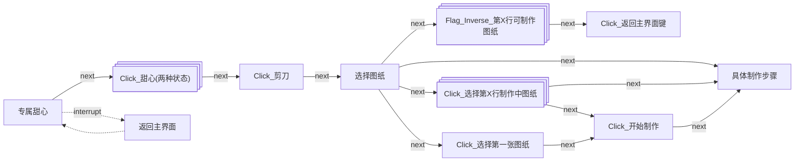
```mermaid
flowchart LR
    n0["专属甜心"] -->|next| n1@{ shape: processes, label: "Click_甜心(两种状态)"}
    n0["专属甜心"] -.->|interrupt| n5["返回主界面"]
    n5 -.-> n0
    n1 -->|next| n2["Click_剪刀"]
    n2["Click_剪刀"] -->|next| n3["选择图纸"]
    n3["选择图纸"] -->|next| n6@{ shape: processes, label: "Click_选择第X行制作中图纸"}
    n3["选择图纸"] -->|next| n7["Click_选择第一张图纸"]
    n3["选择图纸"] -->|next| n8["具体制作步骤"]
    n3["选择图纸"] -->|next| n9@{ shape: processes, label: "Flag_Inverse_第X行可制作图纸"}
    n9 -->|next| n10["Click_返回主界面键"]
    n6@{ shape: processes, label: "Click_选择第X行制作中图纸"} -->|next| n11["Click_开始制作"]
    n6 -->|next| n8["具体制作步骤"]
    n7["Click_选择第一张图纸"] -->|next| n11["Click_开始制作"]
    n11["Click_开始制作"] -->|next| n8["具体制作步骤"]
```

### `Click_选择第一行制作中图纸`

`next`列表里必须有`具体制作步骤`，因为夏彦完成步骤的按钮颜色，与图纸黄色进度条颜色相同，识别到`Click_选择第一行制作中图纸`时也可能在夏彦的图纸具体制作步骤页面。

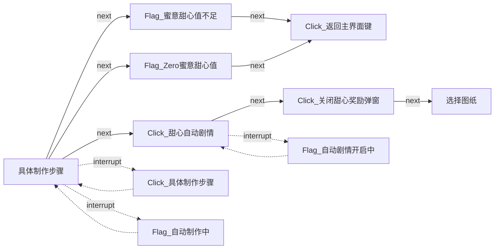
```mermaid
flowchart LR
    n8["具体制作步骤"] -->|next| n14["Flag_蜜意甜心值不足"]
    n8["具体制作步骤"] -->|next| n15["Flag_Zero蜜意甜心值"]
    n8["具体制作步骤"] -->|next| n16["Click_甜心自动剧情"]
    n8["具体制作步骤"] -.->|interrupt| n17["Click_具体制作步骤"]
    n17 -.-> n8
    n8["具体制作步骤"] -.->|interrupt| n18["Flag_自动制作中"]
    n18 -.-> n8
    n14["Flag_蜜意甜心值不足"]  -->|next| n10["Click_返回主界面键"]
    n15["Flag_Zero蜜意甜心值"] -->|next| n10["Click_返回主界面键"]
    n16["Click_甜心自动剧情"] -->|next| n19["Click_关闭甜心奖励弹窗"]
    n16["Click_甜心自动剧情"] -.->|interrupt| n20["Flag_自动剧情开启中"]
    n20 -.-> n16
    n19["Click_关闭甜心奖励弹窗"] -->|next| n3["选择图纸"]
```

### `Flag_自动制作中`

`expected`列表包含的候选项不用删，因为每个男主的界面里这个自动按钮的位置不一样（马哈鱼快出来挨打），而且字体颜色与背景颜色相近，有时就是会识别出奇怪的文字。

## 进修副本.json

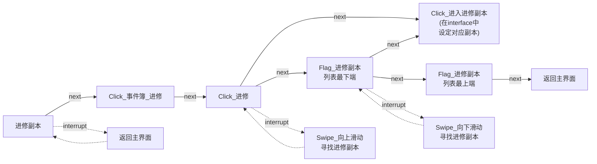
```mermaid
flowchart LR
    n0["进修副本"] -->|next| n1["Click_事件簿_进修"]
    n0 -.->|interrupt| n2["返回主界面"]
    n2 -.-> n0
    n1 -->|next| n3["Click_进修"]

    n3 -->|next| n4["Click_进入进修副本<br>(在interface中<br>设定对应副本)"]
    n3 -->|next| n5["Flag_进修副本<br>列表最下端"]
    n3 -.->|interrupt| n6["Swipe_向上滑动<br>寻找进修副本"]
    n6 -.-> n3
    n6 ~~~ n8

    n5 -->|next| n4["Click_进入进修副本<br>(在interface中<br>设定对应副本)"]
    n5 -->|next| n7["Flag_进修副本<br>列表最上端"]

    n5 -.->|interrupt| n8["Swipe_向下滑动<br>寻找进修副本"]
    n8 -.-> n5

    n7 -->|next| n07["返回主界面"]

```

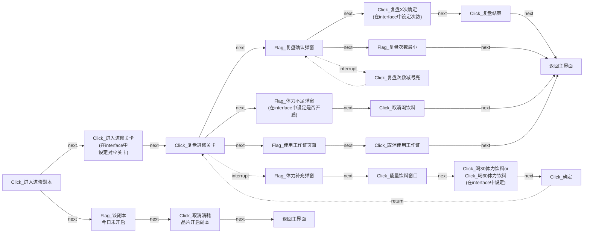
```mermaid
flowchart LR
    n4["Click_进入进修副本"] -->|next| n9["Click_进入进修关卡<br>(在interface中<br>设定对应关卡)"]
    n4 -->|next| n10["Flag_该副本<br>今日未开启"]
    n10 -->|next| n11["Click_取消消耗<br>晶片开启副本"]
    n11 -->|next| n011["返回主界面"]

    n9 -->|next| n12["Click_复盘进修关卡"]
    n12 -->|next| n13["Flag_复盘确认弹窗"]
    n12 -->|next| n14["Flag_体力不足弹窗<br>(在interface中设定是否开启)"]
    n12 -->|next| n15["Flag_使用工作证页面"]
    n12 -.->|interrupt| z["Flag_体力补充弹窗"]
    z3 -.->|return| n12
    z -->|next| z1["Click_能量饮料窗口"]
    z1 -->|next| z2["Click_喝30体力饮料or<br>Click_喝60体力饮料<br>(在interface中设定)"]
    z2 -->|next| z3["Click_确定"]

    n13["Flag_复盘确认弹窗"] -->|next| n16["Click_复盘X次确定<br>(在interface中设定次数)"]
    n13["Flag_复盘确认弹窗"] -->|next| n17["Flag_复盘次数最小"]
    n13 -.->|interrupt| n18["Click_复盘次数减号亮"]
    n18 -.-> n13
    n16["Click_复盘X次确定<br>(在interface中设定次数)"] -->|next| n19["Click_复盘结束"]
    n17 --->|next| n07["返回主界面"]
    n19 -->|next| n07["返回主界面"]

    n14["Flag_体力不足弹窗<br>(在interface中设定是否开启)"] -->|next| n20["Click_取消喝饮料"]
    n20 --->|next| n07["返回主界面"]
    n15["Flag_使用工作证页面"] -->|next| n21["Click_取消使用工作证"]
    n21 --->|next| n07["返回主界面"]
```

## 异常副本.json

```mermaid
flowchart LR
    n0["异常副本"] -->|next| n1["Click_事件簿_异常"]
    n0 -.->|interrupt| n00["返回主界面"]
    n00 -.-> n0
    n1 -->|next| n3["Click_主线"]
    n3 -->|next| n4["Flag_In异常"]
    n3 -->|next| n5["Click_异常"]
    n4 -->|next| n6["Click_主线<br>换篇章按钮"]
    n5 -->|next| n6
    n6 -->|next| n7["Click_选择<br>主线篇章<br>(在interface中<br>设定对应篇章)"]
    n7 -->|next| n8["Click_选择<br>主线篇章确认"]
```

```mermaid
flowchart LR
    n8["Click_选择<br>主线篇章确认"] -->|next| n9["Click_进入异常副本<br>(在interface中<br>设定对应副本)"]
    n8 -->|next| n10["Flag_异常副本<br>列表最下端"]
    n8 -.->|interrupt| n11["Swipe_向上滑动<br>寻找异常副本"]
    n11 -.-> n8

    n10 -->|next| n9["Click_进入异常副本<br>(在interface中<br>设定对应副本)"]
    n10 -->|next| n12["Flag_异常副本<br>列表最上端"]
    n10 -.->|interrupt| n13["Swipe_向下滑动<br>寻找异常副本"]
    n13 -.-> n10

    n12["Flag_异常副本<br>列表最上端"] -->|next| n012["返回主界面"]
    n12 ~~~ n09

    n9 -->|next| n14["Click_进入异常关卡<br>(在interface中<br>设定对应关卡)"]
    n9 -->|next| n15["Flag_异常关卡<br>列表最下端<br>(在interface中设定<br>对应最下端关卡)"]
    n9 -.->|interrupt| n09["Swipe_向上滑动<br>寻找异常关卡"]
    n09 -.-> n9

    n15 -->|next| n14
    n15 -->|next| n16["Flag_异常关卡<br>列表最上端"]
    n15 -.->|interrupt| n015["Swipe_向下滑动<br>寻找异常关卡"]
    n015 -.-> n15
    n16["Flag_异常关卡<br>列表最上端"]-->|next| n012["返回主界面"]
```

```mermaid
flowchart LR
    n14["Click_进入异常关卡"] -->|next| n17["Click_复盘异常关卡"]
    n17 -->|next| n18["Flag_复盘确认弹窗"]
    n17 -->|next| n19["Flag_体力不足弹窗<br>(在interface中设定是否开启)"]
    n17 -->|next| n20["Flag_剩余次数不足"]
    n17 -.->|interrupt| z["Flag_体力补充弹窗"]
    z3 -.->|return| n17
    z -->|next| z1["Click_能量饮料窗口"]
    z1 -->|next| z2["Click_喝30体力饮料or<br>Click_喝60体力饮料<br>(在interface中设定)"]
    z2 -->|next| z3["Click_确定"]

    n18["Flag_复盘确认弹窗"] -->|next| n21["Click_复盘X次确定<br>(在interface中设定次数)"]
    n18["Flag_复盘确认弹窗"] -->|next| n22["Flag_复盘次数最小"]
    n18 -.->|interrupt| n23["Click_复盘次数减号亮"]
    n23 -.-> n18
    n21["Click_复盘X次确定<br>(在interface中设定次数)"] -->|next| n24["Click_复盘结束"]
    n22 --->|next| n012["返回主界面"]
    n24 -->|next| n012["返回主界面"]

    n19["Flag_体力不足弹窗<br>(在interface中设定是否开启)"] -->|next| n25["Click_取消喝饮料"]
    n25 --->|next| n012["返回主界面"]
    n20["Flag_剩余次数不足"] -->|next| n26["Click_取消使用<br>晶片重置次数"]
    n26 --->|next| n012["返回主界面"]
```

## 试炼神殿.json

```mermaid
flowchart LR
    n0["试炼神殿"] -->|next| n1["Judge_试炼神殿_Weekly"]
    n1 -->|next| n2["[JumpBack]体力检查"]
    n1 -->|next| n3["Click_事件簿_活动_当期_试炼神殿"]
    n1 -.->|interrupt| n4["[JumpBack]返回主界面"]
    n4 -.-> n1
    n3 -->|next| n5["Click_活动_当期_试炼神殿"]
    n5 -->|next| n6["Click_当期暗_试炼神殿"]
    n5 -->|next| n7["Click_试炼神殿"]
    n6 -->|next| n7
    n7 -->|next| n8["Flag_试炼神殿_400"]
    n7 -->|next| n9["Click_试炼神殿_继续"]
    n7 -->|next| n10["Click_试炼神殿_困难"]
    n7 -->|next| n11["Flag_In_x3倍数"]
    n8 -->|next| n12["Click_试炼神殿_返回主界面"]
    n10 -->|next| n11
    n10 -->|next| n13["Click_选择倍数箭头"]
    n13 -->|next| n14["Click_选择x3"]
    n14 -->|next| n15["Click_出发"]
    n11 -->|next| n15
    n15 -->|next| n9
    n15 -->|next| n16["Flag_试炼神殿体力不足弹窗"]
    n15 -.->|interrupt| n17["Flag_试炼神殿_自动战斗亮"]
    n15 -.->|interrupt| n18["Click_试炼神殿_自动战斗暗"]
    n15 -.->|interrupt| n19["Flag_自动出卡已开启_试炼神殿"]
    n15 -.->|interrupt| n20["Click_试炼神殿完成"]
    n15 -.->|interrupt| n21["Flag_试炼神殿_获得奖励"]
    n16 -->|next| n22["Click_试炼神殿_取消"]
    n22 -->|next| n12
    n9 -->|next| n17
    n9 -->|next| n18
    n9 -->|next| n19
    n9 -->|next| n20
    n9 -.->|interrupt| n21
    n20 -->|next| n12
    n21 -->|next| n23["Click_试炼神殿_点击空白区域关闭"]
```

试炼神殿是周常副本（每周一次），入口使用 `JudgeWeeklyTask` 进行每周周期判断。进入后选择困难难度，自动设置 x3 倍数（首次需要点击倍率箭头选择），点击出发后自动战斗。战斗过程中识别自动战斗和自动出卡状态，战斗结束后识别 STAGE COMPLETE 画面并返回主界面。

### `Flag_试炼神殿_400`

若识别到分数已达 400 分（本周已打满），直接返回主界面不再继续。

## 外勤委托.json

```mermaid
flowchart LR
    n0["外勤委托"] -->|next| n1["Click_未名日程"]
    n0 -.->|interrupt| n2["返回主界面"]
    n2 -.-> n0
    n1 -->|next| n3["Click_外勤"]
    n3 -->|next| n4["Click_法律援助"]
    n4 -->|next| n5["Click_进入外勤区域<br>(在interface中设定区域)"]
```

```mermaid
flowchart LR
    n5["Click_进入外勤区域"] --->|next| n6["Flag_委托搜寻中"]
    n5 --->|next| n7["Flag_疲劳值满"]
    n5 --->|next| n10["Flag_主界面任务"]
    n5 -..->|interrupt| n11["Click_日常委托"]
    n5 -..->|interrupt| n12["Click_庭审委托"]
    n13 -.->|return| n5
    n6 -------->|next| n13["返回主界面"]
    n7 -------->|next| n13
    n11 -->|next| n16["Click_开始处理外勤委托"]
    n12 -->|next| n16

    n16 -->|next| n8["Flag_体力不足弹窗<br>(在interface中设定是否开启)"]
    n8 -->|next| n14["Click_取消喝饮料"]
    n14 ---->|next| n13["返回主界面"]

    n16 -->|next| n9["Flag_战力不足"]
    n9 ----->|next| n13["返回主界面"]
    n16 -->|next| n17["Flag_疲劳值上限弹窗"]
    n16 -->|next| n18["Click_居中开始辩论"]
    n16 -.->|interrupt| z["Flag_体力补充弹窗"]

    n17 -->|next| n19["Click_取消使用晶片提升疲劳值上限"]
    n19 ---->|next| n13["返回主界面"]
    n19 -->|interrupt| n21["Click_X按钮"]
    n21 -.-> n19

    n18["Click_居中开始辩论"] -->|next| n22["Flag_自动出卡已开启"]
    n18 -.->|interrupt| n23["Click_开启自动出卡"]
    n23 -.-> n18
    n22 -->|next| n24["Flag_辩论失败"]
    n22 -->|next| n25["Click_点击继续"]
    n22 -->|next| n26["Click_结束"]
    n25 --->|next| n26
    n22-.->|interrupt| n27["Flag_自动出卡中"]
    n27 -.-> n22
    n24 ---->|next| n13["返回主界面"]

    z -->|next| z1["Click_能量饮料窗口"]
    z1 -->|next| z2["Click_喝30体力饮料or<br>Click_喝60体力饮料<br>(在interface中设定)"]
    z2 -->|next| z3["Click_确定"]

    n26 -.->|return| n5
    z3 -.->|return| n16
```

由于 `Click_日常委托` 和 `Click_庭审委托` 在`interrupt`列表中，所以遇到战力不足或者体力不足时，虽然游戏回到了主界面但任务逻辑会回到 `Click_进入外勤区域` 节点再次进行识别。因此我们在 `Click_进入外勤区域` 的next中添加了 `Flag_主界面任务` 作为任务出口。 `Click_居中开始辩论` 节点和后续节点位于 `utils.json` 中，如果辩论成功则会停留在外勤界面，如果辩论失败则会回到主界面。

## 补充体力.json

```mermaid
flowchart LR
    n0["补充体力"] -->|next| n1["Click_主界面体力"]
    n0 -.->|interrupt| n2["返回主界面"]
    n2 -.-> n0
    n1 -->|next| n3["Flag_体力补充弹窗"]
    n3 -->|next| n4["Click_能量饮料窗口"]
    n4 -->|next| n5["Click_喝30体力饮料or<br>Click_喝60体力饮料<br>(在interface中设定)"]
    n5 -->|next| n6["Click_确定"]
```

补充体力暂时无法设置使用数量。

## 体力检查.json

```mermaid
flowchart LR
    n0["体力检查"] -->|next| n1["Click_主界面体力_体力检查"]
    n0 -.->|interrupt| n2["[JumpBack]返回主界面"]
    n2 -.-> n0
    n1 -->|next| n3["Flag_体力补充弹窗_体力检查"]
    n3 -->|next| n4["Flag_体力判断"]
    n3 -->|next| n5["Action_禁用体力检查"]
    n4 -->|next| n6["Action_智能策略补充"]
    n6 -->|next| n0
    n5 -->|next| n7["Click_取消"]
```

体力检查是任务开始前自动执行的体力检测模块。与其他任务不同，它是一个**被调用**的模块——由其他任务通过 `[JumpBack]体力检查` 在入口处触发。

流程：点击主界面体力图标 → 识别是否弹出体力补充弹窗 → 使用 `APCheck` 自定义识别判断当前体力是否低于阈值 → 若低于阈值则调用 `SmartReplenish` 智能补充 → 补充后回到体力检查重新判断 → 若体力已达标则用 `DynamicOverride` 禁用体力检查节点，防止后续重复触发。

### 与 补充体力.json 的区别

| | 体力检查.json | 补充体力.json |
| --- | --- | --- |
| 触发方式 | 由其他任务自动调用 | 用户手动选择任务 |
| 体力判断 | 有（APCheck 阈值比较） | 无（直接补充） |
| 智能选择 | 有（SmartReplenish） | 无（固定选择 interface 设定） |
| 循环补充 | 是（直到体力达标） | 否（单次补充） |
| 完成后行为 | 禁用自身，继续任务 | 返回主界面 |

## 未名市移动.json

> ⚠️ **计划中** — 未名市地图导航模块，负责在各建筑中精确定位到具体楼层和房间。此模块尚未完全启用，部分节点存在未解析引用。

## 未名市周任务.json

> ⚠️ **计划中** — 未名市周任务负责自动完成未名市中的每周任务。此模块尚未完全启用。

## 思绪张数任务.json

> ⚠️ **计划中** — 用于往期活动中的思绪张数统计任务。通过事件簿进入活动页面，在往期活动列表中左右滑动寻找目标活动（黄金篇章等），进入后执行相关任务。

## 拼图活动.json

限时拼图活动代币自动领取。与绮思奖励逻辑类似：进入活动页面 → 左右滑动寻找活动入口 → 点击进入 → 点击"获取代币" → 领取免费代币 → 判断是否已全部领取。

使用 `max_hit` 限制滑动次数，`inverse` 识别判断代币是否已领完。

## 翻格活动.json

限时翻格活动代币自动领取。流程与拼图活动基本一致，区别在于活动入口的 OCR 识别文字不同（"指尖甜心"），以及代币领取入口使用 `TemplateMatch` 识别特定图标。

## 购买免费礼包.json

商城限时免费礼包自动购买：

```mermaid
flowchart LR
    n0["购买免费礼包"] -->|next| n1["Click_商城"]
    n0 -.->|interrupt| n2["返回主界面"]
    n2 -.-> n0
    n1 -->|next| n3["Click_礼包"]
    n3 -->|next| n4["Click_限时"]
    n4 -->|next| n5["Click_免费"]
    n4 -->|next| n6["Flag_Inverse_免费礼包"]
    n5 -->|next| n7["Flag_免费礼包购买弹窗"]
    n7 -->|next| n8["Click_点击购买"]
    n8 -->|next| n9["Click_关闭免费礼包奖励弹窗"]
    n8 -.->|interrupt| n10["[JumpBack]Flag_点击开启"]
    n9 -->|next| n4
    n6 -->|next| n11["Click_返回主界面键"]
```

进入商城 → 礼包 → 限时页签 → 寻找"免费"标签 → 点击购买 → 关闭获得奖励弹窗 → 继续寻找下一个免费礼包。当没有更多免费礼包时（`inverse` 识别不到"免费"文字），返回主界面。

## 提交材料活动.json

限时提交材料活动自动完成：

```mermaid
flowchart LR
    n0["提交材料活动"] -->|next| n1["Click_活动_限时提交材料活动"]
    n0 -.->|interrupt| n2["返回主界面"]
    n2 -.-> n0
    n1 -->|next| n3["寻找提交材料活动"]
    n3 -->|next| n4["Flag_提交材料活动"]
    n3 -->|next| n5["Flag_每日签到_提交材料活动"]
    n3 -.->|interrupt| n6["[JumpBack]Swipe_向左滑动寻找提交材料活动"]
    n5 -->|next| n4
    n5 -.->|interrupt| n7["[JumpBack]Swipe_向右滑动寻找提交材料活动"]
    n4 -->|next| n9["Click_提交材料活动"]
    n9 -->|next| n10["Click_提交材料"]
    n9 -->|next| n11["Flag_已提交过材料"]
    n9 -.->|interrupt| n12["[JumpBack]Click_X按钮"]
    n11 -->|next| n13["返回主界面"]
    n10 -->|next| n14["Click_选择提交材料_未名币"]
    n14 -->|next| n15["Click_确认提交材料"]
```

进入活动页面左右滑动找到活动入口，选择提交材料（只能选未名币），确认提交。若今日已提交过则跳过。

## 日志颜色

**普通提示** 昏灰 Dimgray #696969

**任务失败** 红色 Red #FF0000

**任务完成** 柠檬绿 Limegreen #32cd32

**消极类提示** 橙色 Orange #FFA500

**积极类提示** 深天蓝 Deepskyblue #00BFFF
